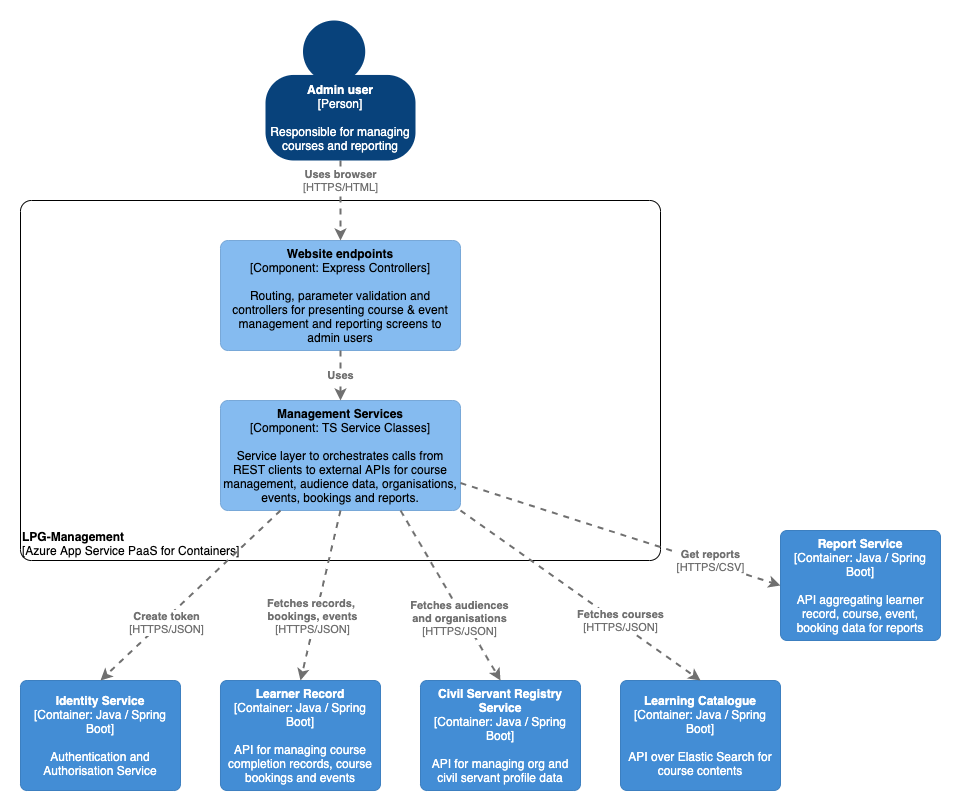

# LPG Management

## Purpose

NodeJS/Express/GOV.UK Frontend based web application for presenting administration screens for main LPG content management and reporting. Allows users with admin roles to upload course content, create courses and events, associate courses with organisations or audiences (e.g. a set of users with a given interest or profession). Enables users with reporting roles to download CSV reports for modules completed, bookings made and learner record summaries.

## Component overview

See the `diagram/` folder for diagram source in draw.io XML format

## Dependencies

### Build-time

For a complete list of package dependencies check the `package.json` file. The main source dependencies are:  
- Azure App Insights 1.5
- typescript 2.9.2
- ts-node 7.0
- tslib 1.9.3
- Express 4.16
- Nunjucks 3.1
- Passport 0.4
- Passport OAuth 1.4
- Axios 0.18
- GOV.UK Frontend 3.3

See also the `package.json` file for imported type definitions as dev dependencies.

### Test-time

For a complete list of test dependencies check the `package.json` file. The main test dependencies are:  
- mocha 5.2
- sinon 6.1
- chai 4.1
- cucumber 4.2.1
- mockserver-client 5.3
- mockserver-node 5.3

### Runtime

#### Other LPG Services

- `identity-service` for to create a new JWT auth token on new requests
- `learner-record` for retrieving learner record data on bookings and course completion
- `civil-servant-registry-service` for getting civil servant user profile data
- `learning-catalogue` for fetching the course details and storing uploaded course metadata for searching
- `report-service` for generating CSV reports on courses and event bookings

#### External integrations

- YouTube API key used to fetch metadata on video course links

#### Data Stores

- none

#### Data migrations

- none

## Build, run, test, deploy

The application requires NodeJS 8 and npm installed to build and run. An exhaustive list of build and run commands can be found in `package.json` under `scripts`.

Resolve application dependencies by running `npm install`

Build the application by compiling Typescript and running the SASS preprocessor: `npm run build`

Run the project with `npm start` or import the project into your IDE of choice such as IntelliJ or VS Code use the IDE commands to Run Application.

Test using `npm run test` for unit tests and `npm run acceptance-test` or choose individual test classes or packages using your IDE.

The application is packaged as a docker container image - see `Dockerfile` in the root directory for the container definition. `hammer` is the log collector used for aggregating log output. App Insights collection libs are baked in at build time (see reference in dependencies in `package.json`).

The application also inclues a `Jenkinsfile` to define the Jenkins build pipeline stages and linking it to the docker image repository and correct terraform module.

Deployment is controlled via the Terraform scripts in the main PaaS repository, with per-environment configuration values referenced there and secrets injected from keybase.

## Configuration

Significant configuration properties are highlighted here. For the full configuration file see `src/config/appConfig.ts` and `src/config/index.ts`

- `cookie` session cookie settings including max validity
- `CONTENT_URL` path for the uploaded course content CDN
- `CONTENT_CONTAINER` reference for the Azure blob storage account for course content
- `AUTHENTICATION` OAuth client settings and paths for the identity service
- `LEARNER_RECORD` path for the learner-record service
- `COURSE_CATALOGUE` path for the learning-catalogue service
- `REGISTRY_SERVICE_URL` path for the civil-servant-registry-service
- `REPORT_SERVICE` path for the civil-servant-registry-service
- `CACHE` internal object cache TTL and check period
- `YOUTUBE_API_KEY` key from CSL account on Google Developer Console used to fetch video metadata

## Licenses

LPG Management is licensed by the MIT license, see `LICENSE` in the root folder for details. Dependent applications are licensed as according to their respective readme and license files.

